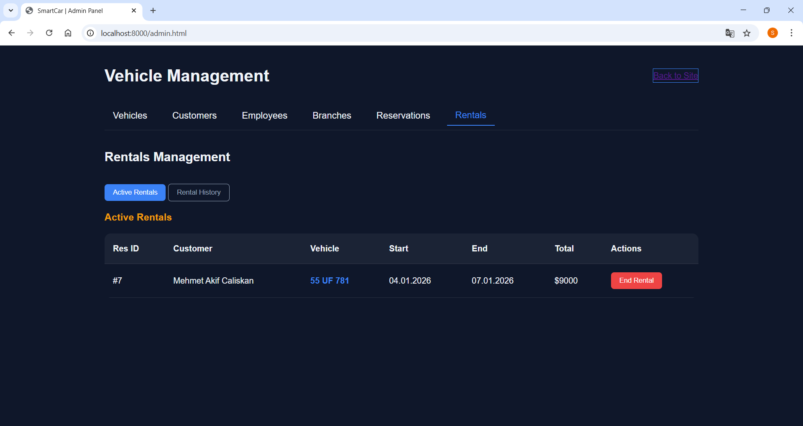
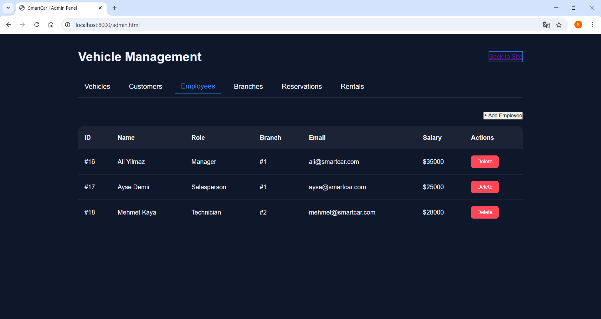
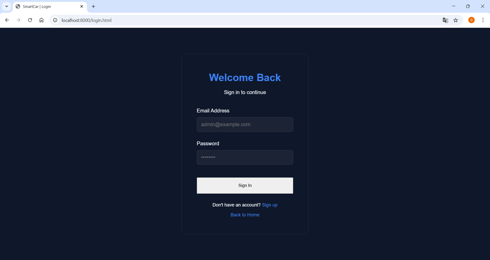
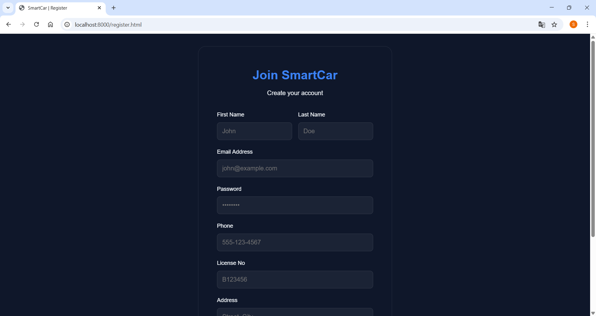
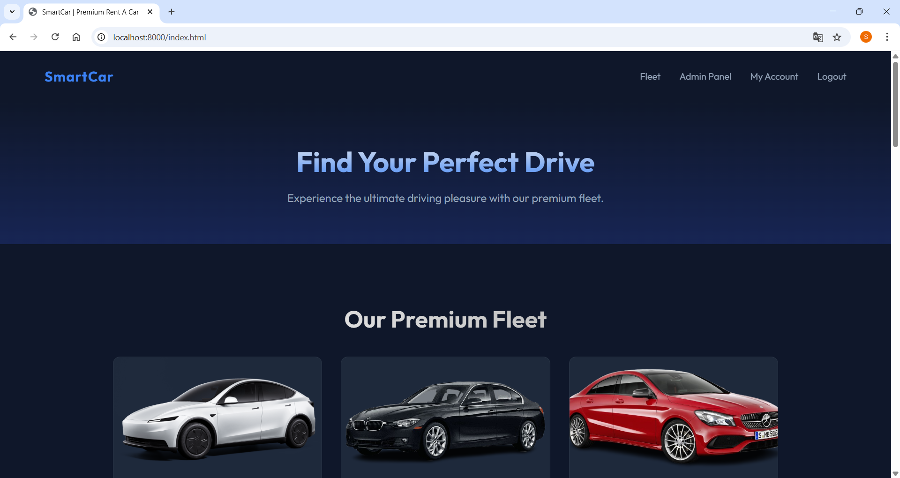
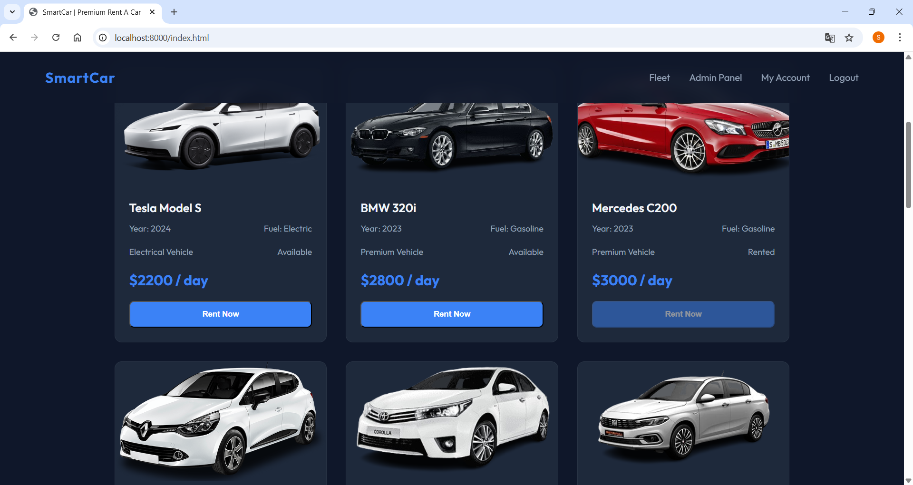
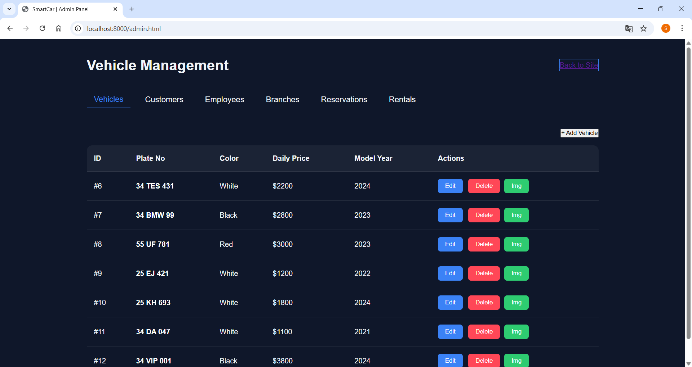

# SmartCar Rental System 🚗

**SmartCar** is a full-stack car rental application designed to provide a premium user experience for renting luxury vehicles. It features a robust backend for managing fleet/reservations and a modern, responsive frontend.

## 🌟 Features

- **Vehicle Fleet**: Browse luxury cars with detailed specs and images.
- **Reservation System**: Date selection, price calculation with additional services (Baby Seat, GPS, etc.).
- **Admin Panel**: Manage Vehicles, Customers, Employees, Branches, and Reservations.
- **Secure Auth**: JWT-based authentication for users and admins.
- **Responsive Design**: Modern UI/UX using pure HTML/CSS/JS (No heavy frameworks).

## 🛠 Technology Stack

- **Backend**: .NET 9.0 (WebAPI, Entity Framework Core)
- **Database**: SQL Server (Code-First Migration)
- **Frontend**: HTML5, Vanilla JavaScript, CSS3
- **Tools**: PowerShell scripts for seeding data.

## 🚀 Getting Started

### Prerequisites
- .NET 9.0 SDK
- Python (for simple HTTP server) or any static file server.

### Automatic Startup
Simply double-click the `start_project.bat` file in the root directory. It will:
1. Start the .NET WebAPI backend.
2. Start the Python Frontend server.
3. Open the application in your default browser.

### Manual Startup
**Backend:**
```bash
cd SmartCar/WebAPI
dotnet run
```

**Frontend:**
```bash
cd Frontend
python -m http.server 8000
```

## 📂 Project Structure

- `SmartCar/`: Backend Solution (Core, Entities, DataAccess, Business, WebAPI).
- `Frontend/`: Web application assets (HTML, CSS, JS).
- `scripts/`: PowerShell scripts for seeding initial data.









 **Note:** This repository houses the **Web Application** version of the project. There is also a companion **Windows Desktop Application** available [here](#) ([Update link](https://github.com/TasanSerhat/SmartCar-Rental-System-WinApp)).

*This project was developed using Google's Antigravity plugin.*

## 📜 License
This project is open source and available under the [MIT License](LICENSE).
